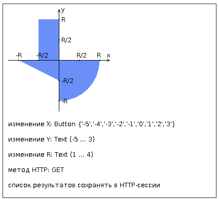

# Лабораторная работа 2, вариант 2381

[Отчет](task/lab2.docx)

## Доп задание

Реализовать авторизацию пользователей с использованием фильтра (AuthFilter). То есть доступ на сайт имеет любой
пользователь, но отправлять формы и осуществлять другие действия могут только авторизованные пользователи. 

__В связи с доп заданием при тестировании приложения для прохождения авторизации в поле U необходимо ввести username, в поле P - password. Дефолтные данные: U: 'user1' -> P: 'qwerty', U: 'user2' -> P: 'qwerty'. Пароли задаются в классе [UsersInitializer](src/main/java/listeners/UsersInitializer.java).__

## Задание

Разработать веб-приложение на базе сервлетов и JSP, определяющее попадание точки на координатной плоскости в заданную
область.

Приложение должно быть реализовано в соответствии с шаблоном MVC и состоять из следующих элементов:

* __ControllerServlet__, определяющий тип запроса, и, в зависимости от того, содержит ли запрос информацию о координатах
  точки и радиусе, делегирующий его обработку одному из перечисленных ниже компонентов. Все запросы внутри приложения
  должны передаваться этому сервлету (по методу GET или POST в зависимости от варианта задания), остальные сервлеты с
  веб-страниц напрямую вызываться не должны.
* __AreaCheckServlet__, осуществляющий проверку попадания точки в область на координатной плоскости и формирующий
  HTML-страницу с результатами проверки. Должен обрабатывать все запросы, содержащие сведения о координатах точки и
  радиусе области.
* __Страница JSP__, формирующая HTML-страницу с веб-формой. Должна обрабатывать все запросы, не содержащие сведений о
  координатах точки и радиусе области.

__Разработанная страница JSP должна содержать:__

1. "Шапку", содержащую ФИО студента, номер группы и номер варианта.
2. Форму, отправляющую данные на сервер.
3. Набор полей для задания координат точки и радиуса области в соответствии с вариантом задания.
4. Сценарий на языке JavaScript, осуществляющий валидацию значений, вводимых пользователем в поля формы.
5. Интерактивный элемент, содержащий изображение области на координатной плоскости (в соответствии с вариантом задания)
   и реализующий следующую функциональность:

* Если радиус области установлен, клик курсором мыши по изображению должен обрабатываться JavaScript-функцией,
  определяющей координаты точки, по которой кликнул пользователь и отправляющей полученные координаты на сервер для
  проверки факта попадания.
* В противном случае, после клика по картинке должно выводиться сообщение о невозможности определения координат точки.
* После проверки факта попадания точки в область изображение должно быть обновлено с учётом результатов этой проверки (
  т.е., на нём должна появиться новая точка).

6. Таблицу с результатами предыдущих проверок. Список результатов должен браться из контекста приложения, HTTP-сессии
   или Bean-компонента в зависимости от варианта.

Страница, возвращаемая AreaCheckServlet, должна содержать:

* Таблицу, содержащую полученные параметры.
* Результат вычислений - факт попадания или непопадания точки в область.
* Ссылку на страницу с веб-формой для формирования нового запроса.

Разработанное веб-приложение необходимо развернуть на сервере WildFly. Сервер должен быть запущен в
standalone-конфигурации, порты должны быть настроены в соответствии с выданным portbase, доступ к http listener'у должен
быть открыт для всех IP.

