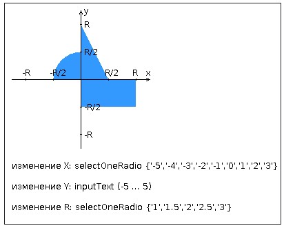

# Лабораторная работа 3, вариант 21

[Отчет](task/lab3.docx)

## Задание

Разработать приложение на базе JavaServer Faces Framework, которое осуществляет проверку попадания точки в заданную область на координатной плоскости.

Приложение должно включать в себя 2 facelets-шаблона - стартовую страницу и основную страницу приложения, а также набор управляемых бинов (managed beans), реализующих логику на стороне сервера.

__Стартовая страница должна содержать следующие элементы:__

* "Шапку", содержащую ФИО студента, номер группы и номер варианта.
* Интерактивные часы, показывающие текущие дату и время, обновляющиеся раз в 13 секунд.
* Ссылку, позволяющую перейти на основную страницу приложения.

__Основная страница приложения должна содержать следующие элементы:__

* Набор компонентов для задания координат точки и радиуса области в соответствии с вариантом задания. Может потребоваться использование дополнительных библиотек компонентов - ICEfaces (префикс "ace") и PrimeFaces (префикс "p"). Если компонент допускает ввод заведомо некорректных данных (таких, например, как буквы в координатах точки или отрицательный радиус), то приложение должно осуществлять их валидацию.
* Динамически обновляемую картинку, изображающую область на координатной плоскости в соответствии с номером варианта и точки, координаты которых были заданы пользователем. Клик по картинке должен инициировать сценарий, осуществляющий определение координат новой точки и отправку их на сервер для проверки её попадания в область. Цвет точек должен зависить от факта попадания / непопадания в область. Смена радиуса также должна инициировать перерисовку картинки.
* Таблицу со списком результатов предыдущих проверок.
* Ссылку, позволяющую вернуться на стартовую страницу.

__Дополнительные требования к приложению:__

* Все результаты проверки должны сохраняться в базе данных под управлением СУБД PostgreSQL.
* Для доступа к БД необходимо использовать JPA с ORM-провайдером на усмотрение студента.
* Для управления списком результатов должен использоваться Application-scoped Managed Bean.
* Конфигурация управляемых бинов должна быть задана с помощью параметров в конфигурационном файле.
* Правила навигации между страницами приложения должны быть заданы в отдельном конфигурационном файле.

 